# 刘涛小组：音乐网站-SpringBoot版本
## 上线地址：[音乐网站](https://music.ltbk.net)

## 安装

```shell
git clone https://gitee.com/lt199934/music-website.git
```

项目地址：[https://gitee.com/lt199934/music-website.git](https://docs.liutao.sale/wp-content/plugins/cp-link-open/link.php?a=aHR0cHM6Ly9naXRlZS5jb20vbHQxOTk5MzQvbXVzaWMtd2Vic2l0ZS5naXQ=)

## 项目部署的时候 需要修改的配置。

1,虚拟路径:

```java
  registry.addResourceHandler("/music/**").addResourceLocations("classpath:/static/music/");
    //        开发环境
    registry.addResourceHandler("/album/**").addResourceLocations("classpath:/static/upload/album/");
    registry.addResourceHandler("/headImg/**").addResourceLocations("classpath:/static/upload/headImg/");
    registry.addResourceHandler("/singer/**").addResourceLocations("classpath:/static/upload/singer/");
    registry.addResourceHandler("/songListImg/**").addResourceLocations("classpath:/static/upload/songListImg/");
    registry.addResourceHandler("/songs/**").addResourceLocations("classpath:/static/upload/songs/");
    //        生产环境
    //        registry.addResourceHandler("/album/**").addResourceLocations("/upload/album/");
    //        registry.addResourceHandler("/headImg/**").addResourceLocations("/upload/headImg/");
    //        registry.addResourceHandler("/singer/**").addResourceLocations("/upload/singer/");
    //        registry.addResourceHandler("/songListImg/**").addResourceLocations("/upload/songListImg/");
    //        registry.addResourceHandler("/songs/**").addResourceLocations("/upload/songs/");
```

2,将music文件夹拷贝到C盘

## 运行

将war包放tomcat下运行并访问

```less
项目的访问地址：localhost:8080/
后台访问的地址：localhost:8080/admin

        默认的用户名和密码
        1,用户：aaa 密码：123123
        2，管理员：admin 密码：admin

项目中 哪些功能可以展示，以及哪些功能是未完成无法展示的。
    1，登录/注册验证，注册时查询用户名是否重复
    2，显示主页，操作时判断登录状态
    3，专辑、歌单，曲库，歌手所有信息显示，歌单/专辑详细页面
    4，所有歌手信息，详细歌手详细未完成
    5，用户界面和其他用户界面未完成
    6，分页和歌单分类查询
    7，音乐播放
    8，优化后台管理系统功能完善页面，美化页面
    9，完善用户对个人信息的查询修改
后期调整整改的 计划和方案
    1，完善用户界面和未完成的功能增加对歌手专辑歌单评论
```
## 项目截图（该版本前端有所变化，抽取组件的形式）

### 前端
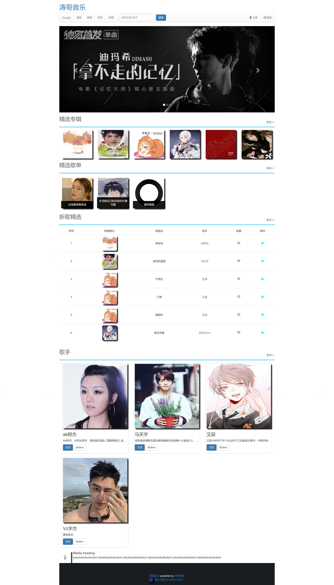

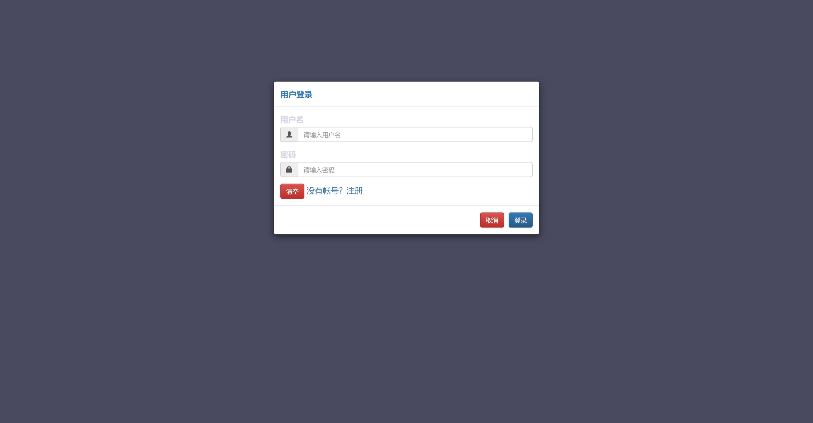

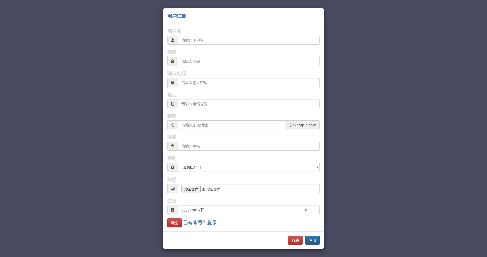

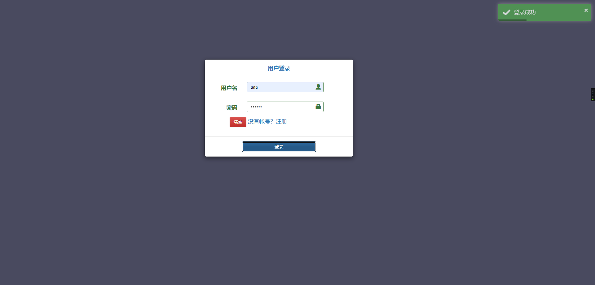

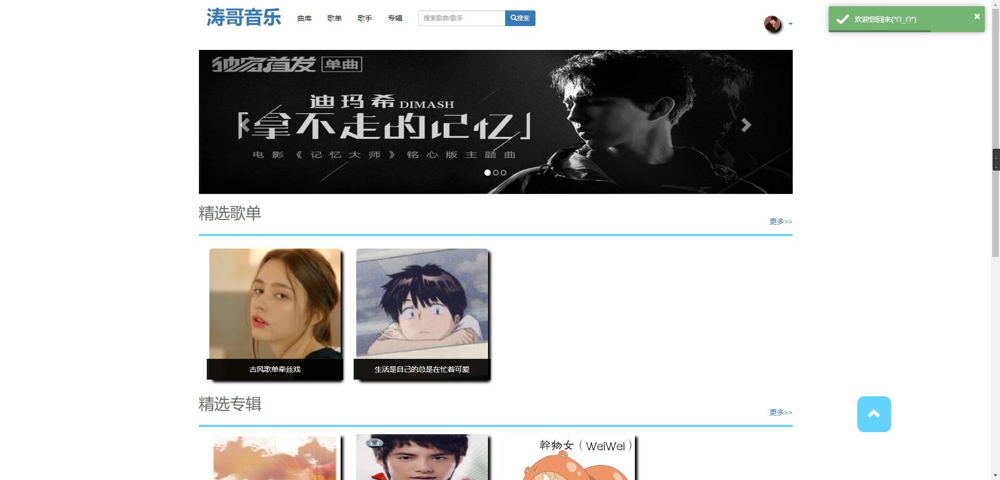

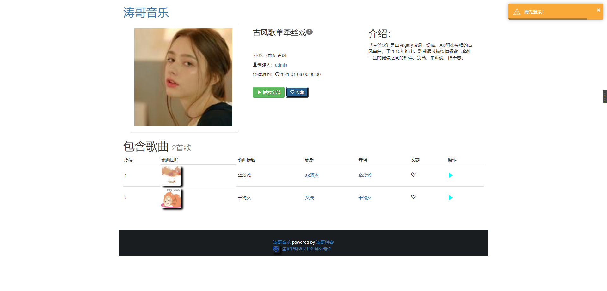

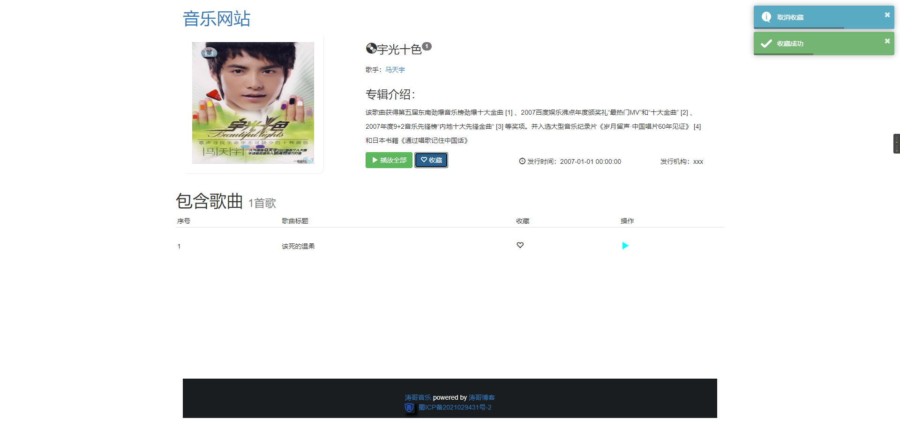

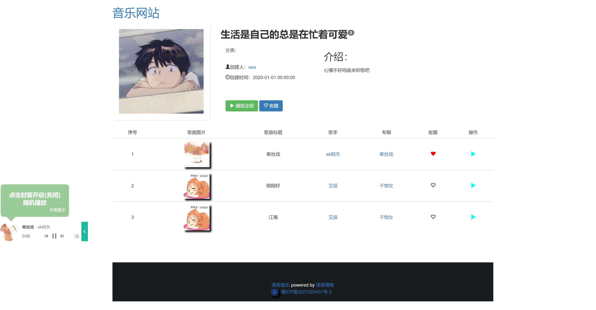

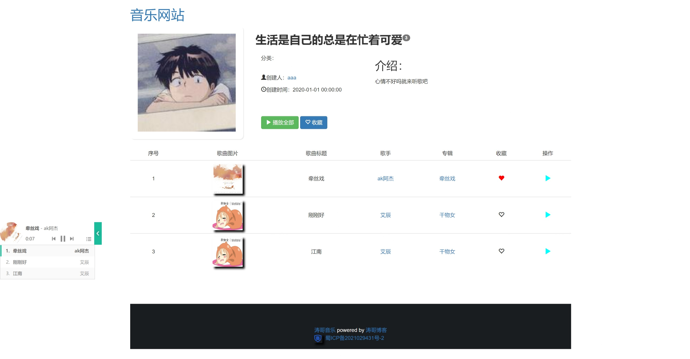

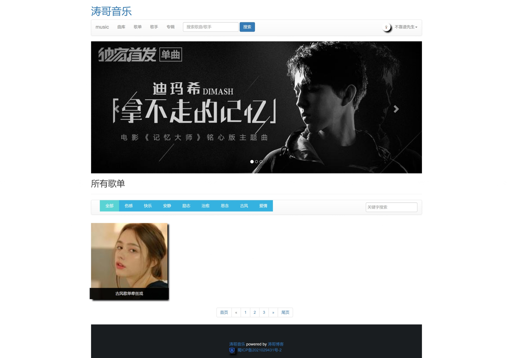

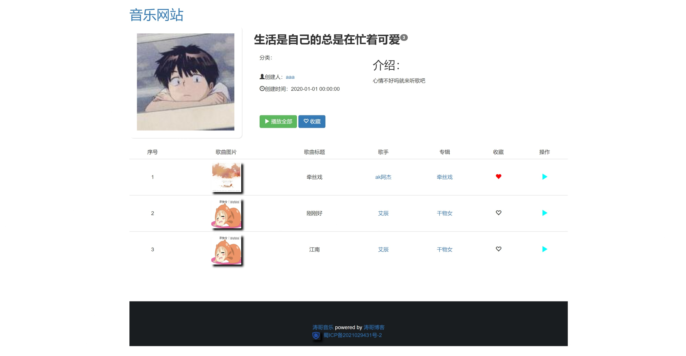


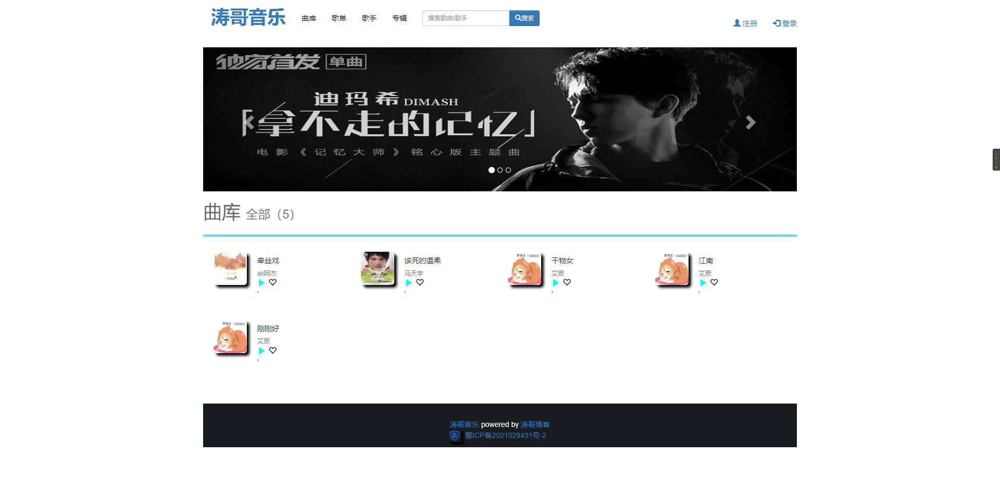


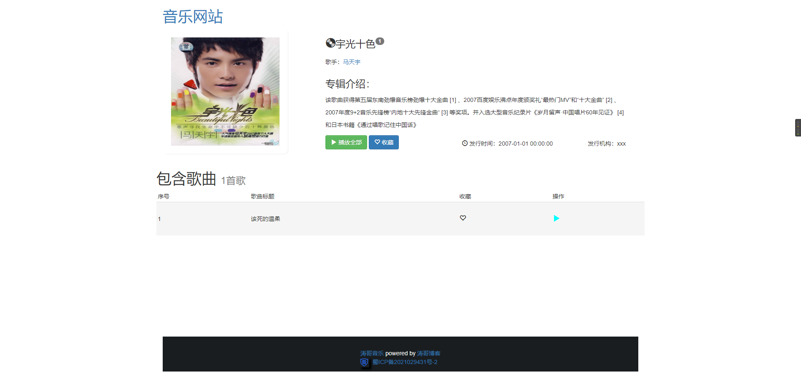

### 后台管理系统


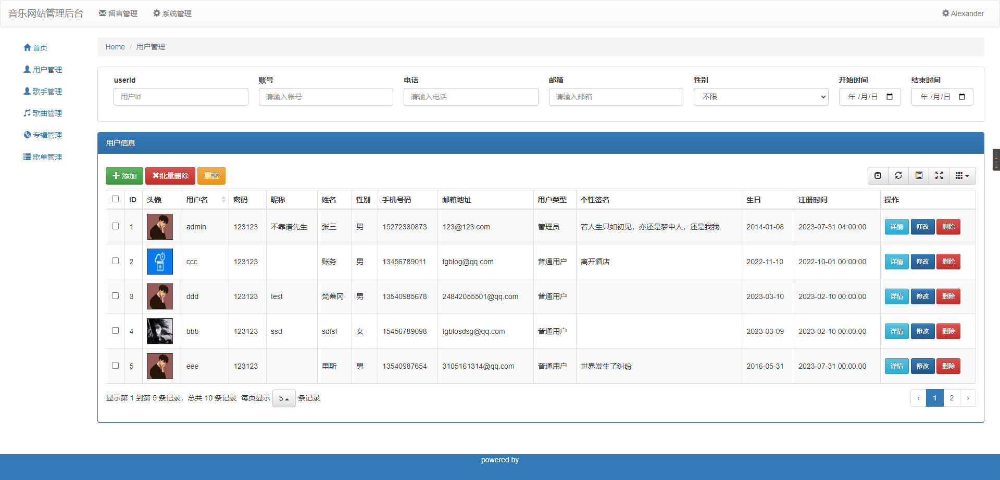

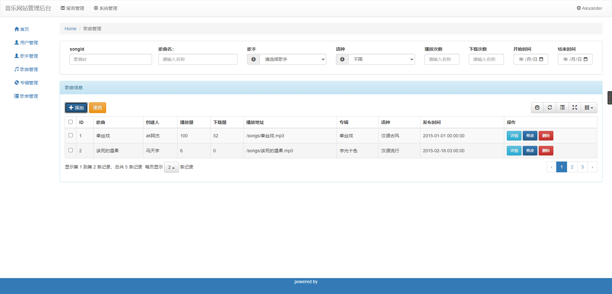

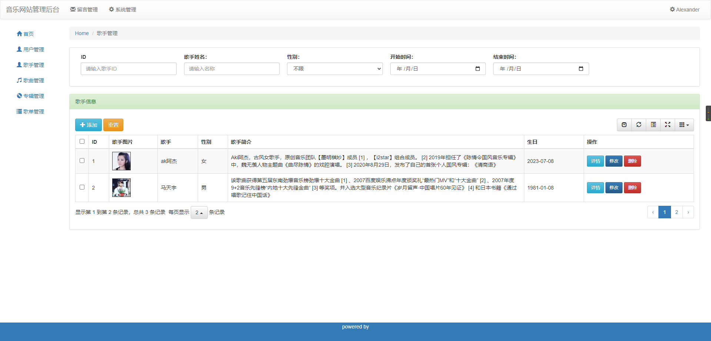

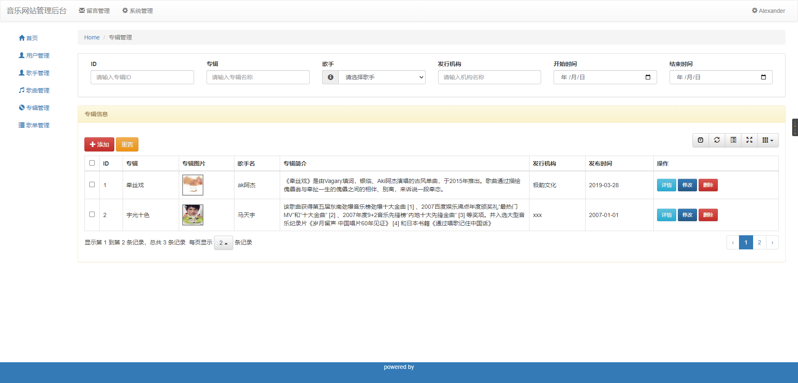

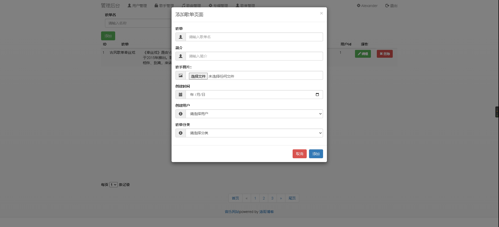

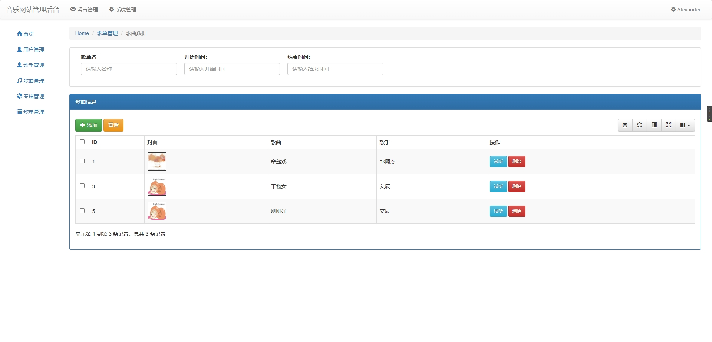

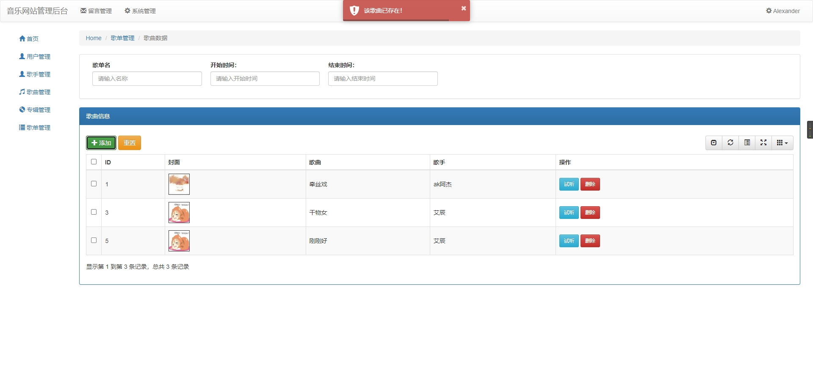


