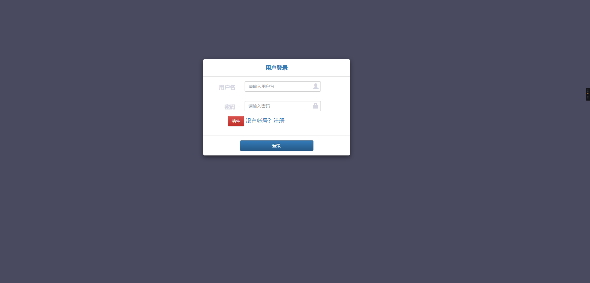
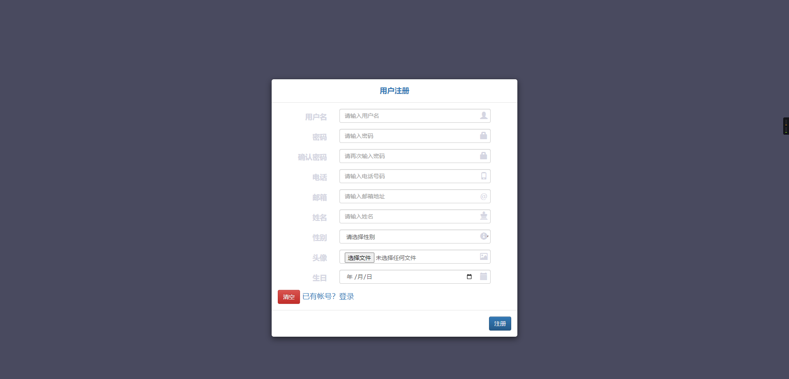
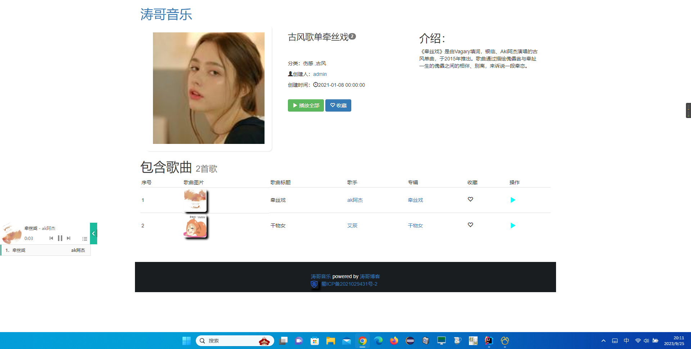
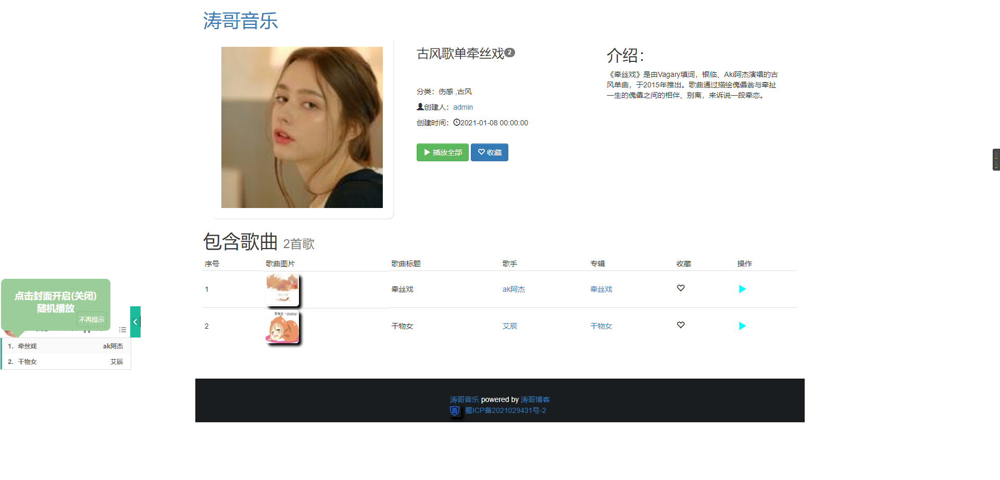
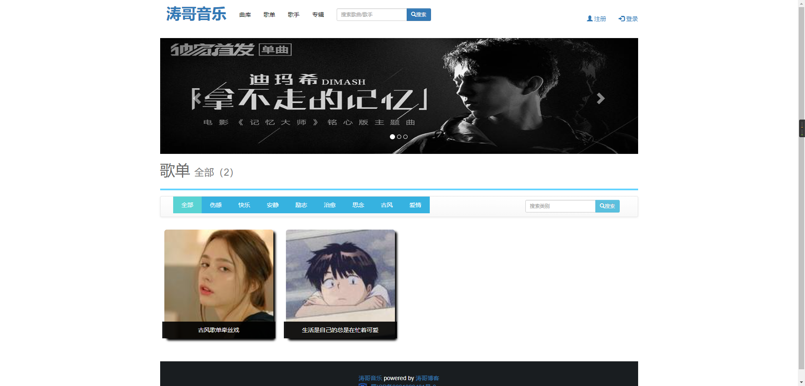
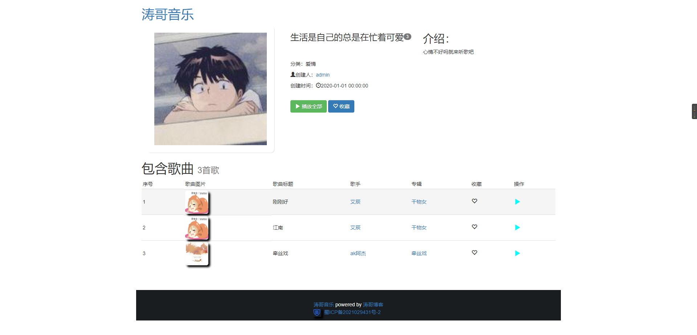
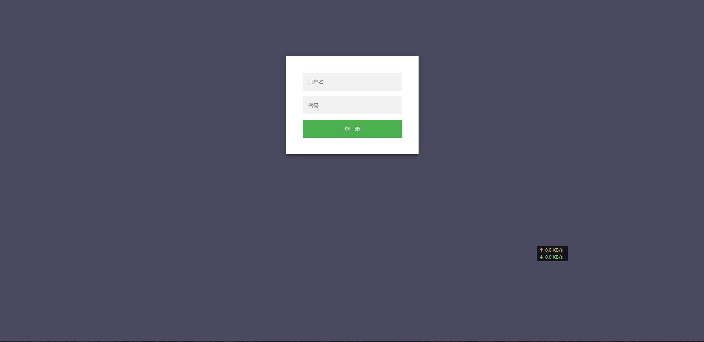
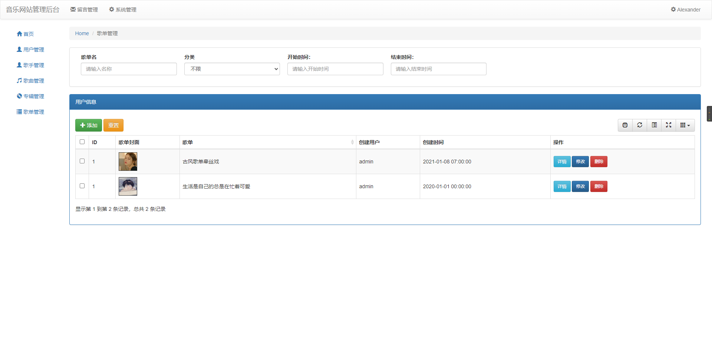

# 刘涛小组：音乐网站
## 上线地址：[音乐网站](https://docs.liutao.sale/wp-content/plugins/cp-link-open/link.php?a=aHR0cHM6Ly9tdXNpYy5sdGJrLm5ldA==)

## 安装

```shell
git clone https://gitee.com/lt199934/music-website.git
```

项目地址：[https://gitee.com/lt199934/music-website.git](https://docs.liutao.sale/wp-content/plugins/cp-link-open/link.php?a=aHR0cHM6Ly9naXRlZS5jb20vbHQxOTk5MzQvbXVzaWMtd2Vic2l0ZS5naXQ=)

## 项目部署的时候 需要修改的配置。

1,虚拟路径:

```xml
<Context path="/album" docBase="c:\music\album"/>
<Context path="/headImg" docBase="c:\music\headImg"/>
<Context path="/singer" docBase="c:\music\singer"/>
<Context path="/songs" docBase="c:\music\songs"/>
<Context path="/songlistImg" docBase="c:\music\songlistImg"/>
```

2,将music文件夹拷贝到C盘

## 运行

将war包放tomcat下运行并访问

```less
项目的访问地址：localhost:8080/musicwebsite/
后台访问的地址：localhost:8080/musicwebsite/login

        默认的用户名和密码
        1,用户：aaa 密码：123123
        2，管理员：admin 密码：admin

项目中 哪些功能可以展示，以及哪些功能是未完成无法展示的。
        1，登录/注册验证，注册时查询用户名是否重复
        2，显示主页，操作时判断登录状态
        3，专辑、歌单，曲库，歌手所有信息显示，歌单/专辑详细页面
        4，所有歌手信息，详细歌手详细未完成
        5，用户界面和其他用户界面未完成
        6，分页和歌单分类查询
        7，音乐播放  
人员分工:
    1，负责ssm框架搭建，前台后台bootsrap页面布局，数据库设计，前端网站开发
    2，后台管理系统开发
    3，音乐插件寻找

后期调整整改的 计划和方案
    1，完善用户界面和未完成的功能增加对歌手专辑歌单评论
    2，优化后台管理系统功能完善页面，美化页面
    3，完善用户对个人信息的查询修改
```

## 项目截图（由于数据比较少所以可能不是特别好看）

### 前端














### 后台管理系统





